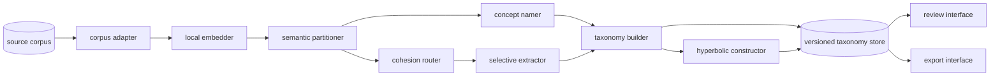

# Product Requirements Document — Cohesion-Gated Taxonomy

Status: research prototype moving toward product validation.

This consolidated PRD follows the repository documentation templates for scope, architecture, workflows, data, operations, internals, and discovery. It adds explicit KPI and falsification contracts. Experimental evidence lives in [Results](docs/RESULTS.md); reproduction instructions live in [Methods](docs/METHODS.md).

## 1. Scope and purpose

### What it is

Cohesion-Gated Taxonomy turns an unlabeled document corpus into a navigable hierarchy, lets a domain expert correct that hierarchy structurally, and selectively spends deep-model inference where corpus geometry indicates uncertainty.

It supports two jobs with different loss functions:

| mode | user question | primary error |
|---|---|---|
| MAP | “Where does each item belong in a taxonomy I already have?” | incorrect assignment |
| EMERGE | “What coherent concepts exist without a supplied taxonomy?” | false merge of distinct concepts |

The system has two geometric layers. Semantic embeddings organize source material and measure local cohesion. A constructed hyperbolic representation stores and navigates the resulting branching hierarchy with geometry matched to exponential tree growth. These layers are complementary; one geometry need not solve every problem.

### Why it exists

Conventional taxonomy creation requires a human or language model to interpret every item. Most linear effort is spent on repetitive, internally consistent material. The product instead performs exhaustive shallow computation locally, summarizes coherent regions once, and concentrates expensive interpretation and human review on uncertain regions.

The intended outcome is not merely lower inference cost. It is a defensible way to discover structure before a playbook exists, expose uncertainty, and preserve the hierarchy as a first-class mathematical object.

### Users

| user | need | surface |
|---|---|---|
| operator or analyst | discover, inspect, rename, and deepen a taxonomy | local web interface |
| domain reviewer | adjudicate uncertain clusters and items | review queue and evidence samples |
| taxonomy steward | approve structural changes and canonical concepts | anchor and version controls |
| downstream consumer | query assignments, extracted values, confidence, and lineage | versioned export or API |
| researcher | reproduce measurements and challenge hypotheses | experiment scripts and artifacts |

### In scope

- Category-blind corpus clustering.
- MAP against a supplied taxonomy and EMERGE without one.
- Canonical naming from representative items.
- Label-free cohesion and multimodality measurements.
- Cohesion-gated routing between cluster propagation and per-item inference.
- Human anchors that cause structural reassignment.
- Novelty and unfitted-item review.
- Concept-to-attribute-to-value decomposition.
- Constructed hyperbolic representation and navigation.
- Versioned exports with source, model, prompt, geometry, and decision provenance.
- Benchmark instrumentation separated from production outputs.

### Out of scope

- Autonomous publication of a high-stakes taxonomy without human approval.
- General document management, legal advice, or contract-risk decisions.
- Continuous numeric extraction through clustering; amounts and dates require per-item extraction.
- A claim that clustering itself is state of the art.
- A claim that every attribute is recoverable from the dominant semantic direction.
- Gradient-trained Poincaré embeddings as a default until they pass a known positive control.
- Multi-tenant hosting and enterprise authorization in the local prototype.

### Boundaries

- **Owns:** discovery, mapping, cohesion scoring, escalation, structural correction, hierarchy representation, and evidence-bearing export.
- **Does not own:** source-system retention, authoritative business labels, legal conclusions, or downstream workflow execution.
- **Escalates to the owner:** taxonomy publication, destructive node removal, low-confidence acceptance, provider changes, and claim promotion.
- **Accountable steward:** repository owner; a named steward is required before external publication.

## 2. Product principles

1. **Exhaustive shallow, selective deep.** Local computation may scale with corpus size; human and frontier-model attention is uncertainty-routed and budget-bounded.
2. **Geometry is layered.** Semantic geometry organizes meaning; hyperbolic geometry represents branching hierarchy. Claims are made per layer.
3. **Uncertainty is visible.** Unfitted items, naming failures, weak cohesion, multimodal leaves, and unresolved values remain explicit.
4. **Corrections are structural.** A rename or anchor can change membership and descendants and creates a taxonomy version.
5. **MAP and EMERGE differ.** MAP optimizes assignment; EMERGE minimizes false merges while allowing coherent coarse concepts.
6. **Gold is evaluation-only.** Reference labels may score frozen outputs but never create predictions or influence clustering, naming, routing, or stopping.
7. **Positive controls precede geometry claims.** A hyperbolic implementation must reproduce a known hierarchy benchmark before comparison.
8. **Every claim has a falsifier.** Metrics, baselines, exclusions, and stopping rules are declared before promotion.

## 3. User flows

### Emerge a taxonomy

The operator imports an unlabeled corpus. The system embeds every item, discovers coherent regions, names them from representative examples, and presents hierarchy, cohesion, seam, size, and sample evidence. The operator can accept, rename, split, merge, or leave a node unresolved.

Success means useful coherent concepts appear without a pre-authored playbook. A coarse but coherent node is acceptable; a leaf concealing distinct concepts is not.

### Map into an existing taxonomy

The operator supplies canonical names and optional descriptions or exemplars. The system embeds these anchors, assigns compatible items, preserves an unfitted pool, and organizes residual material. Review prioritizes low-confidence assignments.

Success means accurate assignment with complete coverage accounting. Unfitted is valid and must not silently become nearest-node assignment.

### Run cohesion-gated extraction

The operator selects a concept and field. The system makes a real cluster-level extraction and propagates it within trusted clusters. Clusters outside the calibrated policy are subdivided or routed to per-item inference.

Success means the configured quality target is met with fewer deep reads than exhaustive inference, measured on identical frozen items using actual model outputs.

### Correct and grow

The operator reviews uncertain or novel items, proposes a canonical concept, and previews structural impact. On approval, the system rebuilds affected assignments and writes a version with a complete diff.

### Deepen concepts

The operator confirms internal structure. Categorical values may become subclusters, continuous values use per-item extraction, and additional provisions become multi-label tags.

### Retrieve and export

The user searches by concept, text, or example and filters by confidence or review state. Results include source item, taxonomy path, extracted fields, confidence, and provenance. Production exports exclude benchmark-only gold fields.

## 4. Workflows

### Workflow: corpus discovery

**Trigger:** an operator starts a build with a corpus and configuration.

1. Validate source identity, item identifiers, text field, and policy.
2. Chunk documents through the source adapter.
3. Create or load normalized local semantic embeddings.
4. Discover a partition and recursively evaluate candidate seams.
5. Compute label-free evidence for every node.
6. Select representatives and request canonical names.
7. Construct the explicit tree and, when enabled, its hyperbolic representation.
8. Persist an immutable candidate run for review.

**Output:** candidate taxonomy, memberships, evidence, coordinates, and provenance.

**Failure behavior:** the run stays incomplete with the failed stage recorded. Naming failure creates an unnamed node and never discards a cluster.

### Workflow: cohesion-gated inference

**Trigger:** an extraction task runs against a frozen taxonomy version.

1. Produce a real cluster prediction for each eligible cluster.
2. Evaluate the cluster through the calibrated routing policy.
3. Propagate when the policy trusts the cluster.
4. Subdivide or read individual items when it escalates.
5. Preserve unresolved values and combine actual predictions.
6. Write item-level provenance and full cost accounting.

**Failure behavior:** failed deep reads become unresolved after bounded retries and never silently fall back to propagation.

### Workflow: structural correction

**Trigger:** a steward proposes a rename, anchor, split, merge, or removal.

1. Record actor, operation, concept, and rationale.
2. Embed the anchor or apply the structural constraint.
3. Recompute affected assignments and descendants.
4. Show membership, confidence, novelty, and cost diffs.
5. Require approval before publication.
6. Persist a child version and rollback pointer.

**Failure behavior:** the prior published version remains active.

### Workflow: experimental validation

**Trigger:** a claim, algorithm, threshold, or model is proposed for promotion.

1. Declare hypothesis, success boundary, falsifier, baselines, and exclusions.
2. Establish positive and negative controls.
3. Freeze calibration and evaluation partitions.
4. Run without gold leakage.
5. Produce machine-readable results and uncertainty.
6. Classify the claim as validated, provisional, falsified, or apparatus-invalid.
7. Update documentation without erasing negative history.

**Failure behavior:** a failed control invalidates the apparatus, not the theory.

## 5. System architecture



### Components

| component | responsibility | current implementation |
|---|---|---|
| corpus adapter | ingest text, identifiers, metadata, and evaluation labels when allowed | dataset loaders |
| local embedder | generate normalized semantic vectors locally | Ollama `nomic-embed-text` |
| semantic partitioner | discover or map clusters, recurse, refine, and anchor | `cluster.py` |
| cohesion router | choose propagation, subdivision, or item reads | `cohesion()` and gate experiments |
| concept namer | generate canonical names from representatives and ancestry | `naming.py` |
| selective extractor | create cluster and item predictions with provenance | `extraction*.py` |
| taxonomy builder | assemble nodes, edges, memberships, and evidence | `build_tree.py`, `cluster.py` |
| hyperbolic constructor | represent an explicit tree through deterministic Möbius placement | `sarkar_construction.py`; integration pending |
| review interface | inspect hierarchy and propose corrections | `server.py`, `index.html` |
| versioned store | preserve immutable runs, diffs, approvals, and rollback | target; prototype rewrites JSON |
| evaluation harness | enforce paired tests, controls, baselines, intervals, and evidence states | experiments; consolidation pending |

### Geometry contract

| layer | represented object | geometry | status |
|---|---|---|---|
| semantic representation | meanings in source text | normalized dense embeddings | operational |
| local partitioning | semantic neighborhoods | cosine or Euclidean baseline; constructed-hyperbolic alternative needs a fair test | baseline operational |
| confidence routing | agreement and candidate seams | cohesion and multimodality | experimental |
| taxonomy representation | explicit branching tree | constructed hyperbolic space | positive control passed; integration pending |
| hierarchy navigation | ancestor, descendant, and neighborhood relations | graph authority plus hyperbolic distance | target |

Hyperbolic hierarchy construction is first-class scope because hyperbolic exponential volume matches tree growth. The admissible implementation is Sarkar-style combinatorial construction. Gradient-trained Poincaré results show that falling loss is not a sufficient health signal; they are not evidence against the geometry.

## 6. Data architecture

### Core entities

| entity | required fields | purpose |
|---|---|---|
| corpus | `corpus_id`, source revision, adapter version, policy | immutable input identity |
| item | `item_id`, source locator, text hash, metadata | stable processing unit |
| embedding | item, model revision, dimension, normalization, hash | semantic representation |
| taxonomy version | ID, parent, mode, configuration, status, steward | immutable snapshot |
| concept node | ID, parent, name, depth, state, human-name flag | explicit concept |
| membership | taxonomy, node, item, evidence | assignment lineage |
| node evidence | cohesion, multimodality, size, representatives, diagnostics | routing and review |
| hierarchy coordinate | taxonomy, node, geometry, dimension, construction revision | tree representation |
| extraction task | field, concept, prompt revision, routing policy | task identity |
| prediction | item, value, route, model call, confidence, unresolved reason | inference evidence |
| correction | actor, operation, rationale, versions, approval | auditable intervention |
| evaluation run | hypothesis, split, controls, metrics, artifacts, verdict | falsification record |

### Separation and lineage

Production records must not contain benchmark-derived `gold_dominant`, `purity`, `gold_top3`, or oracle labels. Evaluation joins gold only after predictions and taxonomy outputs freeze. The prototype currently mixes these fields in `tree.json`; separation is a release requirement.

Semantic embeddings attach to items and model revisions. Hyperbolic coordinates attach to concept nodes and taxonomy versions and regenerate when the hierarchy changes.

```text
source revision
  -> chunking configuration
  -> embedding model and cache
  -> partition configuration and seed
  -> naming model and prompt
  -> taxonomy version
  -> geometry construction and diagnostics
  -> extraction policy and model calls
  -> exported result
```

Published versions are immutable. A correction creates a child version and explicit diff before promotion.

### Privacy and retention

Source text and embeddings remain local by default. Only minimum approved snippets needed for naming or extraction may reach a configured provider. Retention, deletion, and provider data-use policy must be set before confidential data is admitted.

## 7. Data and integrations

### Data owned

| name | kind | current location | purpose |
|---|---|---|---|
| taxonomy snapshot | file | `tree.json` | nodes, edges, evidence, anchors, anomalies |
| membership map | file | `members.json` | node-to-item membership |
| embedding cache | file | `LEDGAR_EMB` or corpus path | avoid repeated embedding |
| experiment output | JSON or console artifact | script-specific | measurements and diagnostics |

The target is an immutable run directory or database. Direct JSON replacement is prototype-only behavior.

### Data read

| source | access | data |
|---|---|---|
| LEDGAR | Hugging Face | clauses and benchmark labels |
| 20 Newsgroups | scikit-learn | posts and benchmark hierarchy |
| Amazon products | Hugging Face | descriptions, categories, attributes |
| WordNet nouns | NLTK | positive-control hierarchy |
| user corpus | local adapter | text, stable IDs, approved metadata |

### Access and integrations

| key or system | direction | purpose |
|---|---|---|
| `DEEPSEEK_API_KEY` | environment | hosted naming or extraction authentication |
| `LEDGAR_EMB` | environment | embedding-cache location |
| `PORT` | environment | local review port |
| Ollama | local HTTP | text in, vectors out |
| OpenAI-compatible endpoint | outbound HTTPS | approved snippets in, names or values out |
| Hugging Face | inbound and cache | public benchmarks |
| NLTK WordNet | local corpus | geometry positive control |

Secrets are environment-injected and never persisted in artifacts, prompts, logs, or committed configuration. Current consumers are the bundled UI and experiment scripts; target consumers include analytical tables, retrieval apps, review queues, and extraction pipelines.

## 8. Quality and operations

### Behavioral contracts

- **No gold leakage:** production decisions cannot read evaluation labels.
- **No silent omission:** every item ends assigned, unfitted, unresolved, or failed.
- **No silent fallback:** a failed deep read cannot become an unmarked propagated answer.
- **No partial publication:** failed rebuilds leave the prior version active.
- **No unqualified comparison:** failed positive control means apparatus-invalid.
- **No orphaned claim:** KPI results link to code, configuration, input, and artifact.
- **Reversible correction:** published structural changes retain a parent and diff.
- **Privacy by default:** embedding is local and external transmission explicit.

### Health

| signal | healthy meaning |
|---|---|
| corpus readiness | source, embeddings, and hashes agree |
| model readiness | configured endpoints pass bounded probes |
| taxonomy readiness | published version is complete and consistent |
| queue state | unresolved and failed items are counted |
| geometry health | coordinates are finite and diagnostics pass |
| evidence health | promoted claims resolve to artifacts and controls |

Quiet means no queued work. Failure means an input, dependency, artifact, invariant, or publication stage is unhealthy; they must not be conflated.

### Tests

- Unit tests for cohesion, multimodality, anchors, diffs, and geometry invariants.
- Property tests proving every item has one terminal state.
- Leakage tests forbidding gold access during production stages.
- Golden deterministic-structure tests.
- Hyperbolic positive-control tests.
- Paired evaluations using actual predictions from every route.
- Failure injection for timeout, malformed model output, corrupt cache, and interrupted rebuild.

### Reproducibility and operation

Each promoted result requires a dependency lock, dataset revision, model ID, prompt hash, configuration, seed, raw response cache, item-level result, summary, and exact command. Hosted output remains provider-version dependent even at temperature zero.

The prototype runs through `build_tree.py` and `server.py`. Broader use requires immutable storage, authentication, structured logs, health, bounded retries, backup and restore, and atomic publication. The server remains loopback-bound until authorization exists.

## 9. Internals

### Decision semantics

| decision | inputs | output | mechanism |
|---|---|---|---|
| MAP split | size, depth, configuration | stop or subdivide | fixed depth and minimum size |
| EMERGE split | vectors and seam score | stop or subdivide | two-means cosine silhouette |
| anchor assignment | item and anchor vectors | anchor or discovery pool | cosine threshold |
| propagation trust | cluster evidence and policy | propagate, subdivide, or read | ranking prototype; calibration pending |
| concept naming | representatives and ancestors | short name or failure | chat model |
| novelty | fit and anomaly evidence | review candidate | hyperbolic misfit path requires revalidation |
| hierarchy placement | explicit graph and settings | coordinates and diagnostics | Sarkar construction |
| claim promotion | controls, results, uncertainty, exclusions | evidence state | manual today; harness required |

### Constants that matter

Prototype values, not universal defaults:

| name | value | consequence |
|---|---|---|
| semantic dimension | 768 | current embedding size |
| MAP maximum depth | 3 | recursion bound |
| root branching | 8 | initial partition |
| child branching | 5 | recursive partition |
| MAP minimum split | 1,200 | small-node stopping |
| EMERGE minimum split | 60 | deeper coherence splitting |
| EMERGE maximum depth | 6 | recursion bound |
| EMERGE seam threshold | 0.10 | candidate split boundary |
| anchor cosine threshold | 0.60 | weaker matches enter discovery |
| naming representatives | 10 | evidence per name |
| random seed | 13 | experiment stability |
| naming workers | 8 | request concurrency |
| default review port | 8799 | loopback UI |
| Sarkar control step | 3.0 | best reported WordNet setting; recalibration required |

Thresholds become versioned policies only after calibration and holdout evaluation.

## 10. Discovery

### Provenance and prior art

The prototype began with category-blind LEDGAR experiments on 2026-08-25 and expanded across legal clauses, 20 Newsgroups, Amazon products, and WordNet through 2026-08-27. Git history is the experiment ledger; corrected claims remain visible.

| foundation | adaptation |
|---|---|
| BERTopic, TopicGPT, TnT-LLM, and Clio | embed, cluster, and name representative groups |
| silhouette and internal validation | label-free cohesion and seam evidence |
| constrained and anchored clustering | human concepts as structural attractors |
| FrugalGPT-style cascades | selective escalation |
| TypiClust and ProbCover | geometry-informed budget allocation |
| Poincaré embeddings and Sarkar/Sala construction | dimension-efficient hierarchy representation |

The scoped contribution is using whole-cluster cohesion, computed before item-level language-model calls, to allocate deep inference between propagation and exhaustive reads. Novelty wording remains “not found in reviewed literature,” not “first.”

### Paid-for lessons

- **2026-08-26:** random tree-pair sampling misled because target distances were nearly constant.
- **2026-08-26:** the Euclidean-wins replacement was withdrawn when the hyperbolic arm failed WordNet.
- **2026-08-27:** Sarkar construction passed the control; gradient optimization, not hyperbolic geometry, caused prior failure.
- **2026-08-27:** the paired hybrid test still uses gold-majority cluster predictions, so product parity is provisional.
- **2026-08-27:** crystallization, blind whitening, annealed refinement, compound-name resolution, and incidental-attribute propagation failed their tests.

## 11. KPIs

### Product outcomes

| KPI | definition | validation target | current state |
|---|---|---|---|
| gated extraction quality | paired difference from exhaustive inference | lower confidence bound within declared non-inferiority margin | provisional; oracle cluster arm |
| deep-call reduction | gated calls divided by exhaustive calls at target quality | at least 5× fewer | oracle-assisted support |
| escalation calibration | propagated error versus predicted trust | declared holdout tolerance | unmeasured |
| coverage | accounted terminal states divided by imports | 100% | requirement |
| review leverage | items divided by human structural decisions | at least 100× at accepted quality | provisional |
| false-merge rate | independently judged items in leaves merging distinct concepts | material reduction versus MAP | provisional; current score shares split signal |
| taxonomy stability | unchanged assignments under equivalent rerun or local correction | use-case threshold | unmeasured |
| hierarchy fidelity | graph preservation and hierarchy retrieval | beat matched Euclidean baselines after controls | WordNet control passed; integration pending |
| time to usable taxonomy | import to first reviewable version | set through discovery | unmeasured |

### Evidence quality

| KPI | target |
|---|---|
| gold-leakage incidents | zero |
| silently dropped items | zero |
| promoted claims without machine artifacts | zero |
| geometry comparisons without passing control | zero |
| published changes without provenance and rollback | zero |
| unresolved model failures surfaced | 100% |

The measured cohesion-to-purity Spearman correlation of `+0.74` across 83 LEDGAR leaves supports risk ranking, not a universal calibration curve. The Sarkar WordNet result—radius-to-depth `+0.774` and tree-distance Spearman `+0.864` in two dimensions—supports constructed hyperbolic hierarchy representation, not automatically semantic clustering or novelty detection.

## 12. Falsification plan

### Core hypotheses

| hypothesis | test | falsifier | consequence |
|---|---|---|---|
| cohesion identifies unsafe propagation | calibrate once, test untouched corpora | no advantage over random or cheaper signals | remove it as primary router |
| gating preserves quality with fewer calls | paired actual cluster and item predictions | non-inferiority fails or savings vanish | narrow tasks or reject claim |
| EMERGE reduces false merges | blind independent review | no material reduction | redesign stopping or retire claim |
| anchors improve structure | compare accepted corrections with frozen prior output | cosmetic gain or damaging collateral movement | separate rename from reassignment |
| hyperbolic space represents taxonomy efficiently | controls and product trees versus matched Euclidean baselines | controls fail, saturation dominates, or hierarchy tasks do not improve | retain graph or change representation |
| hyperbolic structure improves novelty or navigation | equal-cost semantic and graph baselines | no holdout gain | use it for representation only |
| local-first operation is a product wedge | customer and deployment tests | users do not value privacy, emergence, or auditability enough to switch | reposition or stop |

### Required controls

- Random and item-margin routing at equal deep-call budget.
- Exhaustive inference using the same model and frozen items.
- Cluster-first inference using cached real predictions.
- Majority, keyword or regex, and supervised baselines when appropriate.
- WordNet or another known hierarchy before hyperbolic comparisons.
- Degenerate inputs for cluster size, target distance, anchors, and unresolved fields.
- Multiple seeds, samples, and an untouched domain for generality claims.

### Evidence states

| state | meaning |
|---|---|
| validated | controls passed, frozen test met its boundary, artifacts reproduce |
| provisional | evidence exists but an independent metric, control, or holdout is missing |
| falsified | valid apparatus crossed the failure boundary |
| apparatus-invalid | implementation or measurement failed a control; no theory verdict |
| superseded | a later valid experiment replaced the operational conclusion |

## 13. Requirements

### Functional

- F1. Import a corpus without taxonomy labels.
- F2. Produce MAP and EMERGE runs with distinct policies.
- F3. Name every node or expose naming failure.
- F4. Display size, cohesion, seam evidence, representatives, ancestry, and review state.
- F5. Preview correction impact before publication.
- F6. Account for every item as assigned, unfitted, unresolved, or failed.
- F7. Execute categorical cluster extraction and selective escalation.
- F8. Route continuous values to per-item extraction and extra provisions to multi-label classification.
- F9. Build and validate constructed hyperbolic representation when enabled.
- F10. Search and export by concept, item, confidence, review state, and version.
- F11. Keep benchmark labels outside production.
- F12. Record model calls, propagation, corrections, configuration, and lineage.
- F13. Support immutable publication, diff, and rollback.

### Non-functional

- N1. Embeddings run locally by default.
- N2. External calls are budget-capped, attributable, and approved.
- N3. If uncertainty approaches corpus size, report the cost instead of claiming sublinearity.
- N4. Deterministic stages reproduce under fixed inputs, versions, and seeds.
- N5. Accuracy comparisons are paired with uncertainty and declared margins.
- N6. Purity, NMI, AMI, coverage, false merges, and hierarchy fidelity stay distinct.
- N7. Publication is atomic.
- N8. UI remains loopback-only until authorization exists.
- N9. Corpus work supports progress, cancellation, bounded concurrency, and resume.
- N10. Product behavior never depends on benchmark gold.

## 14. Release scope

### Prototype exit

- Replace oracle-majority cluster predictions with cached real predictions.
- Add independent false-merge evaluation.
- Split benchmark instrumentation from production artifacts.
- Integrate Sarkar construction behind a geometry interface while graph edges remain authoritative.
- Add immutable runs, provenance, tests, dependency locking, and machine-readable results.
- Calibrate routing on training data and evaluate untouched holdout performance.

### First usable release

- Local single-user import, discovery, mapping, review, correction preview, publication, rollback, retrieval, and export.
- One supported local embedding model and one configurable OpenAI-compatible endpoint.
- Versioned evidence and cost reports.
- No multi-tenant service, enterprise authentication, or unattended high-stakes publication.

## 15. Risks and open questions

| risk or question | response |
|---|---|
| dominant wording hides incidental attributes | separate projection or per-item extraction |
| EMERGE lacks accepted gold-free evaluation | independent adjudication and agreement measurement |
| cohesion varies across domains | calibrate per embedding model and corpus family |
| hyperbolic coordinates approach the boundary | sweep scale, record saturation, use adequate precision, retain graph authority |
| anchors cause broad movement | preview diffs and require approval |
| hosted models drift | pin where possible and cache request-response provenance |
| filters inflate accuracy | report coverage and exclusions beside accuracy |
| privacy limits hosted inference | support local compatible models and corpus policy |
| call savings commoditize | measure emergence, privacy, auditability, and correction value separately |
| clauses do not prove document performance | validate rollup before contract-level claims |

The next product decision is evidence-gated: complete prototype-exit experiments, then choose whether to optimize review, expand constructed hyperbolic hierarchy capability, or stop. No roadmap claim should outrun those results.
